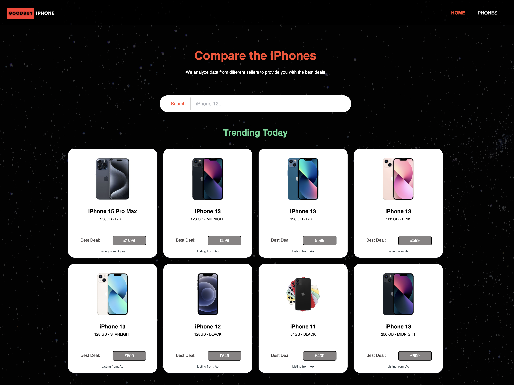
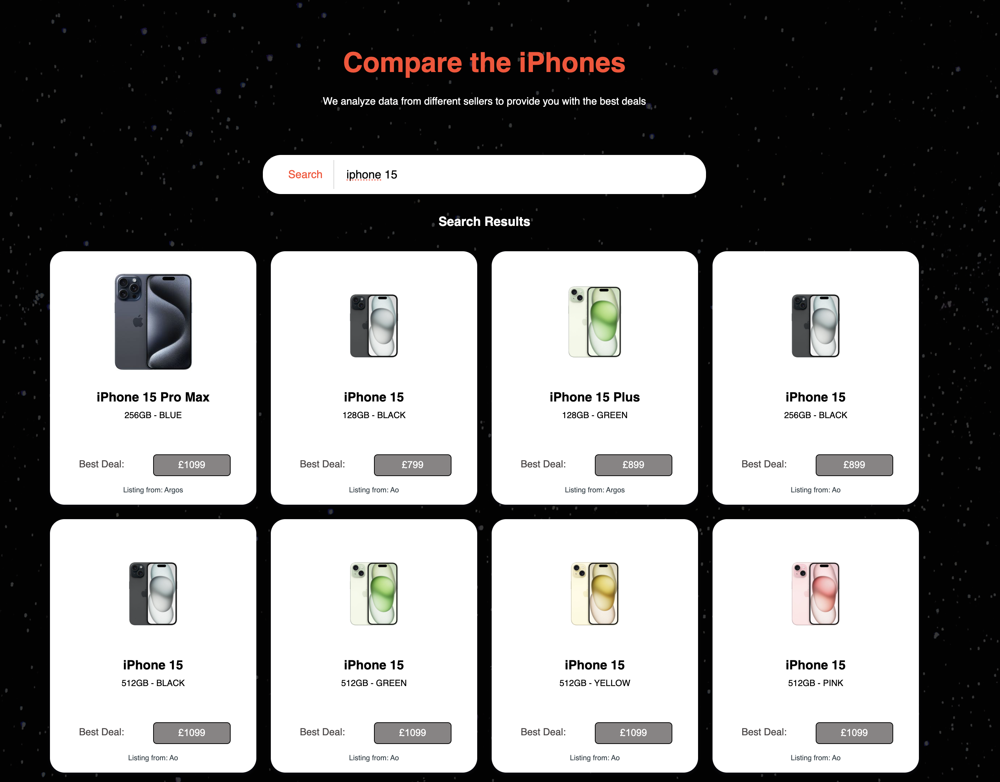
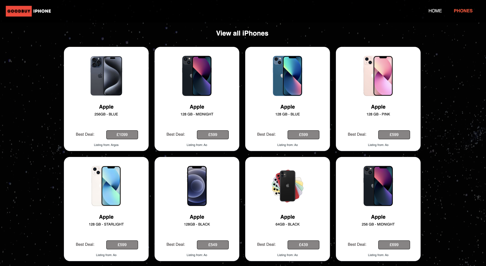

# iPhones Price Finder

Welcome to the iPhones Price Finder project! This web application is designed to simplify the process of finding the best prices for iPhones across multiple websites. It achieves this by scraping iPhone prices from five different websites, storing the data in a database, and then displaying the cheapest option among those websites. 

## Table of Contents

1. [Features](#features)
2. [Website](#website)
3. [Technologies Used](#technologies-used)
4. [Project Structure](#project-structure)
5. [License](#license)
6. [Contact](#contact)

## Features

- **Web Scraping**: The app scrapes iPhone prices from five predefined websites. This ensures you have access to real-time pricing information.

- **Data Storage**: The scraped data is stored in a database for easy access and retrieval. (For Deployement AWS RDS is used.)

- **Price Comparison**: The app calculates and displays the cheapest iPhone option among the five websites, simplifying your purchasing decisions. Along with that it provides the url to origional listing.

- **User-Friendly Interface**: The web interface is designed for user-friendliness, allowing you to quickly and easily view the price comparisons.

## Website

To see the iPhones Price Finder in action, check out the website [here](https://bit.ly/pricescrape).

### Screenshots

- Home Page

- Search Feature

- View all Phones

## Technologies Used

This project is built using the following technologies:

- Java, Maven, Spring, Hibernate, MySQL (for web scraping and backend)
- JavaScript, NodeJs (for the web application)
- HTML/CSS (for frontend design)
- Deployed using AWS - S3, EC2 and RDBMS 

## Project Structure

- `/Web-Scraper`: Contains the Java source code for scraping data.
- `/node-express-ec2`: Restful API directory can be found [here](https://github.com/gsgghotra/)
- `/assets`: Contains public assets, e.g., images, stylesheets.

## License

This project is licensed under the MIT Licence. See the [LICENSE](LICENSE) file for details.

## Contact

For any questions or inquiries, feel free to reach out:

- Email: gsgghotra@gmail.com
- GitHub: [GitHub Profile](https://github.com/gsgghotra/)
- Website: [Portfolio](https://gsgghotra.github.io/bootstrap-portfolio/)

